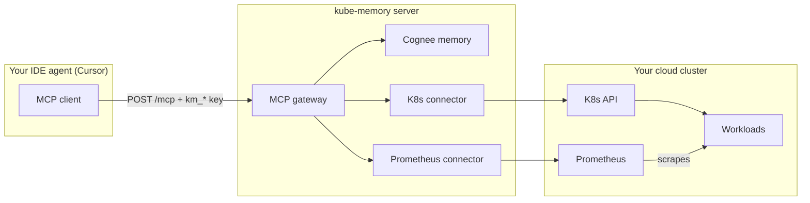

# Kubernetes + Prometheus — prod onboarding & demo guide

End-to-end guide to connect **Kubernetes** and **Prometheus** to kube-memory through the **prod dashboard**, validate integrations, and demo the MCP loop from Cursor.

| Surface | URL |
|---------|-----|
| Dashboard | [localhost:5173](http://localhost:5173/) |
| API / MCP | [localhost:3000](http://localhost:3000/) |
| MCP endpoint | `http://localhost:3000/mcp` |

**Goal:** An agent in Cursor calls prod MCP tools and gets live cluster events, pod logs, Prometheus metrics, and firing alerts — without `kubectl` or local port-forwards on your laptop.

---

## Before you start — the one rule that explains most failures

kube-memory **does not run inside your cluster**. The server runs separately from the cluster. When you click **Test connection** in the dashboard, the API server makes the outbound HTTP call — not your Mac.

| URL type | Works from prod? | Example |
|----------|------------------|---------|
| Public cloud API / ingress | Yes | `https://xxx.gr7.us-west-2.eks.amazonaws.com` |
| Public Prometheus ingress / LB | Yes | `https://prometheus.demo.yourdomain.com` |
| `127.0.0.1` / `localhost` | **No** | kind default API, port-forward |
| In-cluster DNS (`*.svc`) | **No** | `argocd-server.argocd.svc`, `prometheus...monitoring.svc` |

**kind on your Mac + prod MCP URL = broken** unless you tunnel the API or move to a cloud cluster. This guide targets **Track B: cloud cluster + prod server**.

---

## How kube-memory uses integrations

kube-memory follows a **detect → diagnose → treat → remember** loop. Connectors are **pull-based** — the MCP server queries APIs on demand. You never register webhooks inside Kubernetes or Prometheus.



### What each connector stores / reads

| Connector | Credential in dashboard | MCP tools | Solves |
|-----------|-------------------------|-----------|--------|
| **Kubernetes** | Kubeconfig YAML | `k8s_get_events`, `k8s_pod_logs` | *What broke right now?* — OOMKilled, CrashLoop, missing secrets, pod logs |
| **Prometheus** | Base URL + optional bearer token | `prometheus_query`, `prometheus_query_range`, `prometheus_list_alerts`, … | *Was there a signal before it broke?* — memory spikes, CPU, firing alert rules |
| **Memory (Cognee)** | `COGNEE_API_KEY` on server (not UI) | `memory_recall`, `memory_remember`, `predict_risk` | *Have we seen this before?* — institutional memory across sessions |

Together: K8s tells you the **symptom**, Prometheus shows the **metric context**, memory tells you the **last fix that worked**.

---

## Part 1 — Kubernetes

### What Kubernetes is (brief)

Kubernetes runs your containerized workloads. When something fails, the control plane records **Events** (OOMKilled, FailedScheduling, …) and pods emit **logs**. Operators normally run `kubectl get events` and `kubectl logs` — kube-memory exposes that to MCP agents instead.

### How kube-memory uses it

1. You paste a **read-only kubeconfig** in the dashboard.
2. On MCP tool call, the server uses `@kubernetes/client-node` with that config.
3. Tools call the cluster API:
   - `k8s_get_events` → `GET /api/v1/namespaces/{ns}/events`
   - `k8s_pod_logs` → `GET /api/v1/namespaces/{ns}/pods/{name}/log`

**Test connection** runs `listNamespace()` — proves the API server URL and token are valid.

### What problems it solves

| Failure | K8s signal | kube-memory classification |
|---------|------------|----------------------------|
| OOMKilled | Events + exit 137 | `Resource Limit` |
| CrashLoopBackOff | Restart count, back-off events | `CrashLoop / App Exception` |
| Missing Secret | `CreateContainerConfigError` in events | `Configuration Error` |

---

### Kubernetes onboarding (prod UI)

#### Step 1 — Create a cloud cluster

Use any managed Kubernetes with a **public API endpoint**:

- GKE (Autopilot trial works)
- EKS
- DigitalOcean Kubernetes
- AKS

Install `kubectl` locally and confirm:

```bash
kubectl cluster-info
# Must NOT show 127.0.0.1 for prod track
```

#### Step 2 — Deploy demo workloads

From the kube-memory repo:

```bash
kubectl apply -f docs/k8s-test/namespace.yaml
kubectl apply -f docs/k8s-test/reader-rbac.yaml
kubectl apply -f docs/k8s-test/oom-payment-simulator.yaml
```

Wait for failure:

```bash
kubectl get pods -n kube-memory-test -w
# Expected: payment-simulator → OOMKilled or Error
```

#### Step 3 — Build a read-only kubeconfig for kube-memory

The dashboard needs YAML with a **public `server:` URL** and a **ServiceAccount token** (not your personal `~/.kube/config` with localhost).

```bash
TOKEN=$(kubectl create token kube-memory-reader -n kube-memory-test --duration=8760h)
CLUSTER=$(kubectl config view --minify -o jsonpath='{.clusters[0].cluster.server}')
CA=$(kubectl config view --minify --raw -o jsonpath='{.clusters[0].cluster.certificate-authority-data}')

cat <<EOF
apiVersion: v1
kind: Config
clusters:
  - name: kube-memory-test
    cluster:
      server: ${CLUSTER}
      certificate-authority-data: ${CA}
contexts:
  - name: kube-memory-test
    context:
      cluster: kube-memory-test
      namespace: kube-memory-test
      user: kube-memory-reader
current-context: kube-memory-test
users:
  - name: kube-memory-reader
    token: ${TOKEN}
EOF
```

Copy the full output.

#### Step 4 — Connect in prod dashboard

1. Open the [local dashboard](http://localhost:5173/) → sign in
2. **Integrations** → **Kubernetes** → **Connect**
3. Paste kubeconfig YAML
4. **Test connection** → expect *"Kubernetes connection successful"*
5. **Save** → toggle **Enabled**

#### Step 5 — API key + MCP config

1. **API Keys** → create `km_*` key (reader is enough for K8s reads)
2. In Cursor `~/.cursor/mcp.json`:

```json
{
  "mcpServers": {
    "kube-memory": {
      "url": "http://localhost:3000/mcp",
      "headers": {
        "Authorization": "Bearer km_YOUR_KEY_HERE"
      }
    }
  }
}
```

3. Reload MCP / restart Cursor

#### Step 6 — Validate via MCP

Paste into Cursor chat:

```
Use kube-memory MCP only. No kubectl.

1. kube_memory_status — confirm kubernetes is enabled
2. k8s_get_events with namespace "kube-memory-test"
3. k8s_pod_logs for pod "payment-simulator" in namespace "kube-memory-test", tail 100
4. Summarize root cause and recommended fix
```

**Pass criteria:**

- `kube_memory_status` → `kubernetes.enabled: true`
- `k8s_get_events` → OOM / memory-related events (not `ECONNREFUSED`)
- Agent diagnoses **Resource Limit** → raise memory limits

---

## Part 2 — Prometheus

### What Prometheus is (brief)

Prometheus collects **time-series metrics** from your cluster (CPU, memory, HTTP rates, custom app metrics). It evaluates **alert rules** and exposes a query API (PromQL). It answers: *"Was memory climbing before the pod died?"*

### How kube-memory uses it

1. You paste a **Base URL** reachable from Vercel (and optional bearer token).
2. On MCP tool call, the server calls Prometheus HTTP API:
   - `prometheus_query` → `GET /api/v1/query?query=...`
   - `prometheus_list_alerts` → `GET /api/v1/alerts`
   - `prometheus_list_targets` → `GET /api/v1/targets`

**Test connection** tries `GET {baseUrl}/-/healthy`, then `GET {baseUrl}/api/v1/status/config`.

**No webhook setup** — kube-memory reads alerts by polling the API.

### What problems it solves

| Scenario | PromQL / alert | Combined with K8s |
|----------|----------------|-------------------|
| OOM about to happen | `container_memory_working_set_bytes` near limit | Metric spike → then OOMKilled event |
| CPU throttling | `container_cpu_cfs_throttled_seconds_total` | Throttling before latency complaints |
| Demo alert | `KubePodCrashLooping`, `KubeMemoryOvercommit` | `prometheus_list_alerts` + `k8s_get_events` |

---

### Prometheus onboarding (prod UI)

#### Step 1 — Install Prometheus in the same cluster

Helm (kube-prometheus-stack — includes Prometheus + Alertmanager):

```bash
helm repo add prometheus-community https://prometheus-community.github.io/helm-charts
helm install prom prometheus-community/kube-prometheus-stack \
  --namespace monitoring --create-namespace
```

Find the service name:

```bash
kubectl get svc -n monitoring | grep prometheus
# Common: prom-kube-prometheus-stack-prometheus  OR  prometheus-kube-prometheus-prometheus
```

#### Step 2 — Expose Prometheus with a public URL

Prod server must reach Prometheus. Pick **one**:

| Method | Base URL example | Notes |
|--------|------------------|-------|
| **Ingress + TLS** (recommended) | `https://prometheus.demo.yourdomain.com` | Best for prod demos |
| **LoadBalancer** | `http://<EXTERNAL-IP>:9090` | Quick on GKE/DO; lock down by IP if possible |
| **Managed Prometheus** | Provider query endpoint root | Grafana Cloud, AWS AMP — use their docs |

**Do not use** for prod dashboard:

- `http://localhost:9090` (port-forward on your Mac)
- `http://prometheus...monitoring.svc:9090` (in-cluster DNS)

Example — expose via LoadBalancer (demo only):

```bash
kubectl patch svc prom-kube-prometheus-stack-prometheus -n monitoring \
  -p '{"spec":{"type":"LoadBalancer"}}'
kubectl get svc -n monitoring prom-kube-prometheus-stack-prometheus -w
# Note EXTERNAL-IP → Base URL: http://<EXTERNAL-IP>:9090
```

Verify from any machine on the internet (not just your laptop):

```bash
curl -s "http://<EXTERNAL-IP>:9090/-/healthy"
# Should return: Prometheus is Healthy.
```

#### Step 3 — Connect in prod dashboard

1. [Local dashboard](http://localhost:5173/) → **Integrations** → **Prometheus** → **Connect**
2. **Base URL** — root only, no trailing slash, no `/api/v1`:
   - Good: `http://35.xxx.xxx.xxx:9090`
   - Bad: `http://35.xxx.xxx.xxx:9090/api/v1`
3. **Bearer token** — leave empty unless Prometheus is behind auth
4. **Test connection** → *"Prometheus connection successful"*
5. **Save** → toggle **Enabled**

#### Step 4 — Validate via MCP

```
Use kube-memory MCP only.

1. kube_memory_status — confirm prometheus is enabled
2. prometheus_list_alerts
3. prometheus_list_targets
4. prometheus_query with query: sum by (namespace, pod) (container_memory_working_set_bytes{namespace="kube-memory-test"})
5. Briefly interpret memory usage for payment-simulator
```

**Pass criteria:**

- `prometheus.enabled: true` in status
- `prometheus_list_targets` shows UP scrape targets
- Memory query returns a numeric series for the demo namespace

---

## Part 3 — Combined demo flow (K8s + Prometheus + memory)

This is the story to show judges or teammates: **metric warning → pod failure → recall past fix**.

### Prerequisites checklist

- [ ] Cloud cluster (public K8s API) — not kind/localhost
- [ ] `payment-simulator` OOMKilled in `kube-memory-test`
- [ ] Prometheus installed + **public Base URL**
- [ ] `COGNEE_API_KEY` set on prod server (for memory tools)
- [ ] Kubernetes + Prometheus: **configured + enabled** in dashboard
- [ ] `km_*` key in Cursor → `http://localhost:3000/mcp`

### 10-minute demo script

| Min | Say / do | MCP tools |
|-----|----------|-----------|
| 0 | *"Something is wrong in kube-memory-test"* | `k8s_get_events`, `k8s_pod_logs` |
| 2 | *"Was memory climbing before the crash?"* | `prometheus_query` (memory working set) |
| 4 | *"Any firing alerts?"* | `prometheus_list_alerts` |
| 5 | *"Have we seen this OOM before?"* | `memory_recall` |
| 6 | Diagnose: 64Mi limit vs 200Mi allocation | Agent reasoning |
| 7 | Apply fix (human, kubectl) | `kubectl apply -f docs/k8s-test/oom-payment-simulator-fixed.yaml` |
| 8 | *"Remember this for next time"* | `memory_remember` |
| 9 | Break again + recall | `memory_recall`, `predict_risk` |

### Copy-paste MCP script (full loop)

**Act 1 — Detect (K8s + Prometheus)**

```
Use kube-memory MCP only. No kubectl.

1. kube_memory_status
2. k8s_get_events namespace "kube-memory-test"
3. k8s_pod_logs pod "payment-simulator" namespace "kube-memory-test" tail 100
4. prometheus_list_alerts
5. prometheus_query: sum(container_memory_working_set_bytes{namespace="kube-memory-test", pod="payment-simulator"}) by (pod)
6. Root cause category and fix recommendation
```

**Act 2 — Remember**

```
Use kube-memory MCP only.

Call memory_remember with episode:
- service: payment-simulator
- symptom: OOMKilled in kube-memory-test
- cause: 64Mi memory limit, stress allocates 200Mi
- treatment: raise limits to 256Mi (oom-payment-simulator-fixed.yaml)
- outcome: open
```

**Act 3 — Human applies fix**

```bash
kubectl delete pod payment-simulator -n kube-memory-test --ignore-not-found
kubectl apply -f docs/k8s-test/oom-payment-simulator-fixed.yaml
```

**Act 4 — Close loop**

```
Use kube-memory MCP only.

1. memory_remember — update outcome: resolved after 256Mi limit
2. memory_recall — "OOMKilled payment-simulator"
3. predict_risk — serviceName "payment-simulator"
4. prometheus_query — confirm memory working set is below new limit
```

### Useful PromQL for demos

```promql
# Memory per pod in demo namespace
sum by (pod) (container_memory_working_set_bytes{namespace="kube-memory-test"})

# Pod restart rate
increase(kube_pod_container_status_restarts_total{namespace="kube-memory-test"}[15m])

# Pods not ready
kube_pod_status_ready{condition="false", namespace="kube-memory-test"} == 1
```

---

## How the application behaves (request path)

Understanding this helps debug integration issues.

1. **Dashboard (browser)** → JWT session → `PUT /connectors/kubernetes` or `PUT /connectors/prometheus` on `localhost:3000`
2. Secrets encrypted at rest (`CONNECTOR_ENCRYPTION_KEY` on server)
3. **Test connection** → server decrypts secret → outbound call to K8s API or Prometheus
4. **MCP tool call** (Cursor) → `POST http://localhost:3000/mcp` with `Authorization: Bearer km_*`
5. Server resolves workspace from API key → loads connector → same outbound call as test
6. **`kube_memory_status`** reads MongoDB only (does not hit K8s/Prom) — so `enabled: true` does not guarantee live API access

| Symptom | Meaning |
|---------|---------|
| Status OK, K8s tools fail | Kubeconfig points at unreachable host (localhost) |
| Test fails in UI | Server cannot reach URL — fix networking first |
| MCP 401 | Wrong or revoked `km_*` key |
| `memory_*` fails | `COGNEE_API_KEY` missing on prod |

---

## Troubleshooting

| Symptom | Cause | Fix |
|---------|-------|-----|
| `ECONNREFUSED 127.0.0.1:55xxx` | Prod server + kind/local kubeconfig | Cloud cluster with public API, or local server (`localhost:3000/mcp`) |
| K8s test OK, MCP fails | Connector saved but not **enabled** | Toggle Enabled on Integrations |
| Prometheus test fails | Base URL not reachable from Vercel | Use LB/Ingress; verify with `curl` from outside your network |
| `*.svc` URL fails | In-cluster DNS | Expose via ingress/LB |
| Trailing space in Base URL | Copy-paste | Re-enter URL with no spaces |
| Empty `k8s_pod_logs` | Pod already terminated (OOM) | Rely on `k8s_get_events` |
| `memory_recall` empty | No episodes yet | Run `memory_remember` first |
| Prometheus query empty | Wrong namespace/pod labels | `prometheus_list_labels` to discover labels |

---

## Local dev vs prod (quick reference)

| Item | Local dev | Prod (this guide) |
|------|-----------|-------------------|
| Dashboard | `localhost:5173` | Your dashboard URL |
| MCP URL | `http://localhost:3000/mcp` | Your API URL + `/mcp` |
| Cluster | kind / minikube OK | Cloud cluster with public API |
| K8s kubeconfig | Can use localhost API | Must use public `server:` URL |
| Prometheus URL | `http://localhost:9090` + port-forward | Public ingress or LoadBalancer |
| Who calls the APIs? | Your laptop (local server) | Vercel (prod server) |

Use [test-k8.md](./test-k8.md) Track A for kind + local server learning. Use **this doc** for prod demos.

---

## Final checklist

### Kubernetes

- [ ] Cloud cluster running; API is public (not 127.0.0.1)
- [ ] `kube-memory-test` namespace + OOM pod deployed
- [ ] Read-only SA kubeconfig pasted in dashboard
- [ ] Test → Save → **Enabled**
- [ ] `kube_memory_status` → kubernetes enabled
- [ ] `k8s_get_events` returns OOM events

### Prometheus

- [ ] kube-prometheus-stack (or equivalent) installed
- [ ] Base URL reachable from internet (`curl /-/healthy`)
- [ ] Test → Save → **Enabled**
- [ ] `prometheus_list_targets` shows UP targets
- [ ] Memory query returns data for demo namespace

### MCP demo

- [ ] `km_*` key in Cursor → prod MCP URL
- [ ] Combined script runs without `ECONNREFUSED`
- [ ] `memory_remember` + `memory_recall` round-trip (needs `COGNEE_API_KEY` on prod)

---

## Related docs

- [test-k8.md](./test-k8.md) — detailed K8s scenarios + kind local track
- [demo-environment.md](./demo-environment.md) — full multi-connector topology
- [mcp-tools.md](./mcp-tools.md) — MCP tool reference
- [server/API_DOC.md](../server/API_DOC.md) — REST API for `/ingest` and connectors
